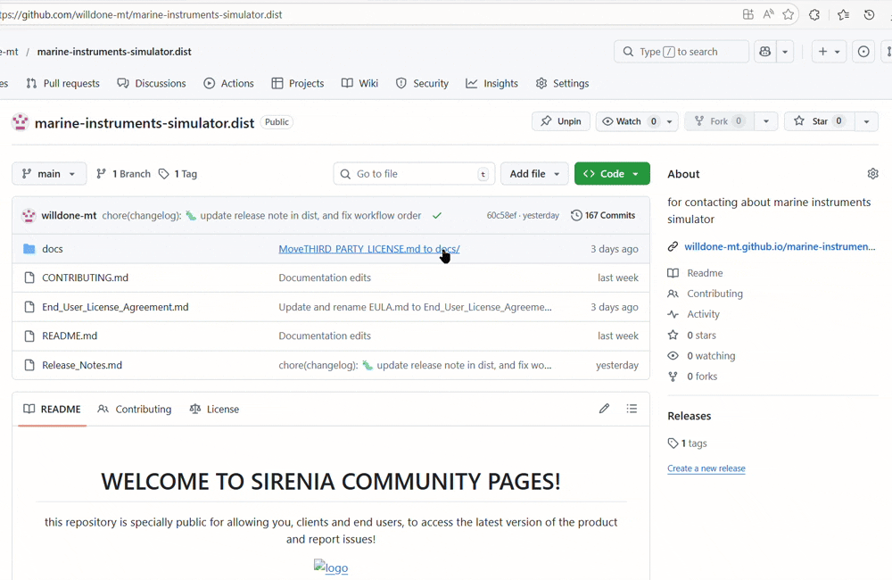

# WELCOME TO SIRENIA DISTRIBUTION PAGES

this repository is specially public for allowing you, clients and end users, to access the latest version of the product and report issues!

  
  <h1>SIRENIA</h1>
  
  

    A Marine Scientific Instruments Simulator
  

  
<!-- Badges -->

# 📔 Table of Contents

- [📔 Table of Contents](#-table-of-contents)
- [🐳 About the Project](#-about-the-project)
  - [📸 Screenshots](#-screenshots)
  - [🎯 Features](#-features)
- [🧩 Tech Stack](#-tech-stack)
- [🧰 Getting Started](#-getting-started)
  - [‼️ System Requirements](#️-system-requirements)
  - [⚙️ Downloading](#️-downloading)
  - [🧪 Running](#-running)
- [🪜 Development](#-development)
  - [🗺️ Roadmap](#️-roadmap)
  - [🆘 Contributing](#-contributing)
  - [❓ FAQ](#-faq)
- [Credits](#credits)
  - [📜 License](#-license)
  - [🤝 Contact](#-contact)
  - [💎 Acknowledgements](#-acknowledgements)

# 🐳 About the Project

Sirenia is a simulator software focusing on replicating the operation of marine scientific instruments in real-life field.
[WIP]
This software also planned to be able to open third-party software such as the instrument's launcher and data pre-processing software.
I intended to make it as an warmer up before student/user handling the real fragile instrument, or at least as a introduction or lesson to teach when there is no available real-life instrument.

## 📸 Screenshots

  

## ⛵ Features

- Implemented Instruments:
  - Hand Refractometer

# 🐙 Tech Stack

- **Main Programming Language Used: Python 🐍**

# 🧰 Getting Started

Read this for end users to succesfully run the app!

## ‼️ System Requirements

So far its only been tested on developers' devices. However, only the RAM which has been recorded and it's not exceeded than double `SIRENIA.exe`'s file size.

## ⚙️ Downloading

You can directly download the [latest version of `SIRENIA.exe` from here](https://github.com/willdone-mt/marine-instruments-simulator.dist/releases/latest) or you can access the tags available on the sidebar on the home page of the repository for specific version.

Although, it is recommended that you also download this repository linked to the version you downloaded to help you go trough the app or if there are any dependencies located in this repository.

Down here are the detailed steps to download the software. _(i swear these is just my verbosity, not AI slop)_:

1. Make sure you are in the **home page** of this repository
2. Navigate/move cursor to the right side, find and click `tags`
3. You should be directed to git tags page of this project
4. **Find the version** you want to download, then click it
5. You should be directed to the pages which version you choose
6. Scroll down a bit, you should find drop-down list labeled `assets`
7. In there, there's a label **`SIRENIA.exe`**, click that
   - Optional, you may also download the `Source code (zip)`
8. The download should begin

You can watch this gif below if you still confused about the procedur above.

## 🚤 Running

To run the software, simply find the Sirenia.exe and double click it. It should be running just fine.

Again, it is recommended to run the app in the extracted zip of the repository to ensure all depedencies is be run.

Down here are the detailed steps to run the software, step 1 till 4 are optional.  _(enjoy the not on purpose recorded music)_:

1. Make sure **you downloaded `SIRENIA.exe` and the `Source code (zip)`**
2. **Extract the `.zip`** file anywhere you like
3. Once done, **move `SIRENIA.exe` into the folder** which contains other files from the source code.
4. **Double click `SIRENIA.exe`** to run

You can watch this gif below if you still confused about the procedur above.

# 🪜 Development

## 🗺️ Roadmap

See [`roadmap.md` here](./docs/roadmap.md) to see the list we working up to or heads up to Project Tab of this repo.

## 🆘 Contributing

Contributions are always welcome! especially from you! the user!

You as end user can mainly contribute to this project by reporting issues.
See [`contributing.md` for ways to get started. here!](./CONTRIBUTING.md)

## ❓ FAQ

# Credits

## 📜 License

WIP EULA

## 📨 Contact

Wildan M. Mursalin - [WIP]

Project Accessible Link: <https://github.com/willdone-mt/marine-instruments-simulator.dist>

## 💎 Acknowledgements
