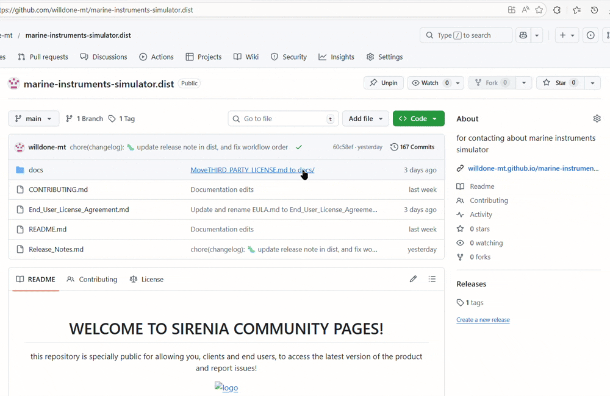

# WELCOME TO SIRENIA DISTRIBUTION PAGES

this repository is specially public for allowing you, clients and end users, to access the latest version of the product and report issues!

<h1>SIRENIA</h1>
  

A Marine Scientific Instruments Simulator

  
<!-- Badges -->

# 📔 Table of Contents

- [WELCOME TO SIRENIA DISTRIBUTION PAGES](#welcome-to-sirenia-distribution-pages)
- [📔 Table of Contents](#-table-of-contents)
- [🐳 About this Software](#-about-this-software)
  - [📸 Screenshots](#-screenshots)
  - [⛵ Features](#-features)
- [🐙 Tech Stack](#-tech-stack)
- [🧰 Getting Started](#-getting-started)
  - [‼️ System Requirements](#️-system-requirements)
  - [⚙️ Downloading](#️-downloading)
  - [🚤 Running](#-running)
  - [How To Use](#how-to-use)
- [🪜 Development](#-development)
  - [🗺️ Roadmap](#️-roadmap)
  - [🆘 Contributing](#-contributing)
  - [❓ FAQ](#-faq)
- [Credits](#credits)
  - [📜 License](#-license)
  - [📨 Contact](#-contact)
  - [💎 Acknowledgements](#-acknowledgements)

# 🐳 About this Software

**SIRENIA** is an educational simulation software that recreates the operation of marine scientific instruments used in field research. 
It was created to provide a better introduction to scientific instruments, especially when real instruments are limited, fragile, or unavailable.

The software is intended for YOU, and anyone, especially students in marine science preparing for laboratory or field work.
It provides a safe environment where you can explore, learn, and practice how these instruments work before using real equipment, 
helping you become familiar with their interfaces, workflows, and basic procedures.

The current version simulates the operation of an analog hand refractometer, with additional instruments planned for future development.
Future versions will also support integration with third-party software, including instrument launchers and data pre-processing tools.

## 📸 Screenshots

  

## ⛵ Features

- Implemented Instruments:
  - Hand Refractometer

  

# 🐙 Tech Stack

- **Main Programming Language Used: Python 🐍**

# 🧰 Getting Started

End users must read this to succesfully run the app!

## ‼️ System Requirements

For now, SIRENIA can only run on Windows OS due to the packager only available in the said OS

## ⚙️ Downloading

You can directly download the [latest version of `SIRENIA.exe` from here](https://github.com/willdone-mt/marine-instruments-simulator.dist/releases/latest) or you can access the tags available on the sidebar on the home page of the repository for specific version.

Although, it is recommended that you also download this repository linked to the version you downloaded to help you go trough the app or if there are any dependencies located in this repository.

Down here are the detailed steps to download the software. _(i swear these is just my verbosity, not AI slop)_:

1. Make sure you are in the **home page** of this repository
2. Navigate/move cursor to the right side, find and click `tags`
3. You should be directed to git tags page of this project
4. **Find the version** you want to download, then click it
5. You should be directed to the pages which version you choose
6. Scroll down a bit, you should find drop-down list labeled `assets`
7. In there, there's a label **`SIRENIA.exe`**, click that
   - Optional, you may also download the `Source code (zip)`
8. The download should begin

You can watch this gif below if you still confused about the procedur above.

## 🚤 Running

To run the software, simply find the Sirenia.exe and double click it. It should be running just fine.

Again, it is recommended to run the app in the extracted zip of the repository to ensure all depedencies is be run.

Down here are the detailed steps to run the software, step 1 till 3 are optional.:

1. Make sure **you downloaded `SIRENIA.exe` and the `Source code (zip)`**
2. **Extract the `.zip`** file anywhere you like
3. Once done, **move `SIRENIA.exe` into the folder** which contains other files from the source code.
4. **Double click `SIRENIA.exe`** to run

You can watch this gif below if you still confused about the procedur above.

## How To Use

Follow the instruction on [this section](#-running).
Then, once you choose the instrument you want to learn,
read carefully the window that pop-up after that,
which contains the basic information of the instrument,
and the interaction you need to do equivalent in-real-life procedure

# 🪜 Development

SIRENIA had reach v0.1.0!

## 🗺️ Roadmap

See [`roadmap.md` here](./docs/roadmap.md) to see the list we working up to or heads up to Project Tab of this repository.

## 🆘 Contributing

Contributions are always welcome! especially from you! the user!

You as end user can mainly contribute to this project by reporting issues.
See [`contributing.md` for ways to get started. here!](./CONTRIBUTING.md)

## ❓ FAQ

- **Is this a marine modeling and simulation software?**
  
  **No**, this is not a marine modeling software, nor phenomenon simulation. 
  The main point of this software is to replicate the experience of using marine instruments, 
  especially in measuring and sampling parameters  

# Credits

## 📜 License

> WIP EULA

## 📨 Contact

Wildan M. Mursalin - [WIP]

Project Accessible Link: <https://github.com/willdone-mt/marine-instruments-simulator.dist>

## 💎 Acknowledgements
